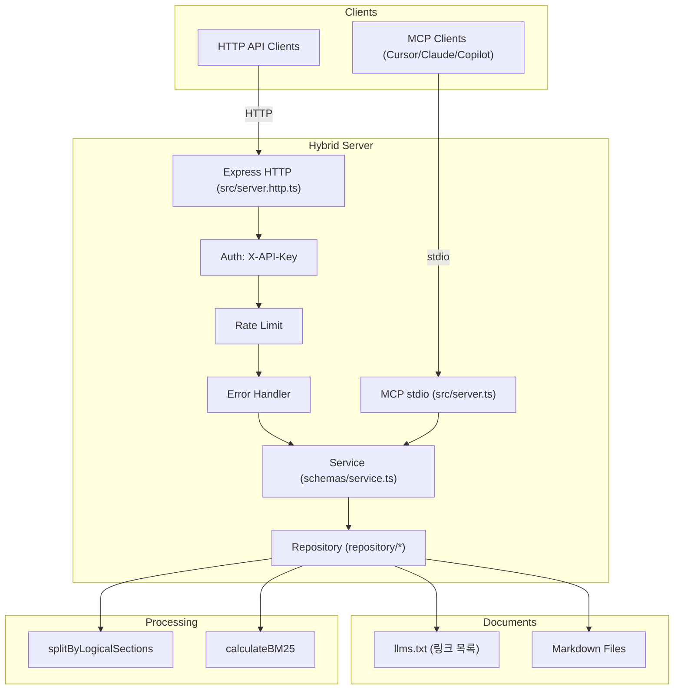

# 나이스페이먼츠 developers MCP 서버 프로젝트 분석 문서

## 📋 목차
1. [프로젝트 개요](#1-프로젝트-개요)
2. [시스템 아키텍처](#2-시스템-아키텍처)
3. [프로젝트 구조](#3-프로젝트-구조)
4. [핵심 컴포넌트 분석](#4-핵심-컴포넌트-분석)
5. [데이터 플로우](#5-데이터-플로우)
6. [핵심 알고리즘](#6-핵심-알고리즘)
7. [API 명세](#7-api-명세)
8. [코드 품질 및 패턴](#8-코드-품질-및-패턴)
9. [확장 가능성](#9-확장-가능성)
10. [개선 제안사항](#10-개선-제안사항)
11. [사용방법(예)](#11-사용방법(예))
---

## 1. 프로젝트 개요 (필수)

나이스페이먼츠 개발자 문서를 수집·청킹하고 BM25로 검색해 MCP(Model Context Protocol) 및 HTTP API로 제공하는 서비스입니다.
- 본 MCP 서버의 목표는 고객사가 MCP 서버를 통해 관련 내용(결제승인, 결제취소, 결제창 연결)을 손쉽게 수집, 참조하고 생성형 도구(claude, cursor, chatgpt, github copilot 등)를 이용한 소스 코드 작성을 지원함으로써 결제 기능을 보다 편리하고 신뢰성 있게 구현하도록 돕는 것이다.

- 패키지명: `@nicepayments/developers-guide-mcp`
- 런타임/언어: Node.js 22.x, TypeScript
- 제공 모드: MCP(stdio), HTTP, Hybrid(MCP+HTTP)
- 주요 기능: 나이스페이먼츠 developers 페이지 정보 제공, 문서 청킹/검색(BM25), MCP 툴 제공, API 키 인증, Rate Limiting, 에러 핸들링

---

## 2. 시스템 아키텍처 (필수)



---

## 3. 프로젝트 구조 (필수)
```text
src/
├─ config/            # 환경 로드/검증 (zod)
├─ constants/         # 상수
├─ document/          # 마크다운 로딩/청킹/메타데이터
├─ middleware/        # 인증, 레이트리밋, 에러핸들러
├─ repository/        # 문서 저장소 + 검색
├─ schemas/           # 서비스 레이어 (툴 핸들러)
├─ utils/             # BM25 등 유틸리티
├─ server.ts          # MCP(stdio) 서버
├─ server.http.ts     # HTTP 서버
└─ server.hybrid.ts   # MCP+HTTP 하이브리드 서버
```

---

## 4. 핵심 컴포넌트 분석 (필수)
- MCP 서버: `src/server.ts` — 툴 등록(`get_documents`, `document-details`) 및 stdio 트랜스포트 연결
- 하이브리드 서버: `src/server.hybrid.ts` — MCP + Express HTTP 브릿지, 인증/레이트리밋/에러 처리 포함
- 서비스: `src/schemas/service.ts` — 키워드 검색, 결과 포맷
- 저장소: `src/repository/*` — 문서 로딩, BM25 검색, 청크 윈도우링
- 문서 처리: `src/document/*` — 마크다운 fetch/파싱/청킹, 메타데이터 추출

---

## 5. 데이터 플로우 (부가)
1) `llms.txt` 로드 → 링크 수집 → 마크다운 fetch → 논리 섹션 청킹 → 메타데이터/키워드 수집 → 저장소 적재
2) 검색 요청 → BM25 스코어링 → 상위 N 선택 → 청크 윈도우 적용 → 결과 포맷 후 반환
3) 상세 요청 → 문서 ID 매칭 → 원문 마크다운 반환

---

## 6. 핵심 알고리즘 (부가)
- BM25(k1=1.2, b=0.75) 기반 정규화 스코어 계산
- 대소문자/변형 키워드 세트 구성, 정규식 OR 매칭
- 청크 윈도우 제공으로 주변 문맥 포함

---

## 7. API 명세 (필수)

### MCP 도구
- get_documents
  - 요청: `{ keywords: string[] }`
  - 응답: `{ content: [{ type: "text", text: string }], isError?: boolean }`
- document-details
  - 요청: `{ id: string }`
  - 응답: `{ content: [{ type: "text", text: string }], isError?: boolean }`

### HTTP 엔드포인트 (하이브리드/HTTP 모드)
- 인증: 헤더 `X-API-Key: <your-api-key>` (필수, `/health`는 선택)
- Rate Limit: 검색(50/15m), 상세(200/15m), 헬스(10/1m)

- 헬스체크
```bash
curl -s http://localhost:3000/health | cat
```
- 문서 검색
```bash
curl -s -X POST http://localhost:3000/mcp/get_documents \
  -H 'Content-Type: application/json' \
  -H 'X-API-Key: YOUR_KEY' \
  -d '{"keywords":["인증","결제","API"]}' | cat
```
- 문서 상세
```bash
curl -s http://localhost:3000/mcp/document-details/5 \
  -H 'X-API-Key: YOUR_KEY' | cat
```

---

## 8. 코드품질 및 패턴 (부가)
- 타입 안전성: zod 기반 환경 검증(`src/config/validation.ts`), 명시적 타입 선언
- 레이어드 아키텍처: 서버/서비스/저장소/문서처리/유틸 분리
- 에러 처리: 표준화된 에러 응답, 요청 ID 전파, 개발환경 스택 노출
- 보안/안정성: API 키 인증, 키별 Rate Limiting, 입력 스키마 검증

---

## 9. 확장 가능성 (부가)
- 검색엔진 교체/추가: BM25 → TF-IDF/임베딩/Hybrid
- 문서 소스 확장: 웹 크롤링, API, DB, Git 리포지토리
- 응답 형식: 텍스트 → JSON/HTML/PDF 등 가공 계층 추가
- 캐시: 메모리/파일/Redis

---

## 10. 개선 제안사항 (부가)
- 구성 외부화 확대: 경로/파라미터 환경변수 일원화
- 테스트 커버리지 확장: 알고리즘/통합 경로 테스트
- 관측성: 성능/에러 메트릭, 구조화 로깅 도입
- API 버전 관리: v2 추가 시 병행 제공

---

## 11. 사용방법(예) (필수)

### 설치/빌드
```bash
npm install
npm run build
```

### 실행
```bash
# MCP(stdio)
npm start

# HTTP
npm run start-http

# Hybrid
npm run start-hybrid
```

### 환경변수 (.env 예시: `env.example` 참고)
```
PORT=3000
NODE_ENV=development
LOG_LEVEL=info
API_KEYS=test-key-123,prod-key-456
NICEPAY_DATA_PATH=./src/llm/llms.txt
NICEPAY_BASE_URL=https://github.com/supersignal/going_on_hypersonic/blob/main
NICEPAY_MARKDOWN_PATH=/src/markdown
NICEPAY_LLM_PATH=/src/llm
BM25_K1=1.2
BM25_B=0.75
MAX_SEARCH_RESULTS=10
```


---

*📝 작성일: 2025년8월5일*  
*🔄 최종 업데이트: 2025년9월2일* 
