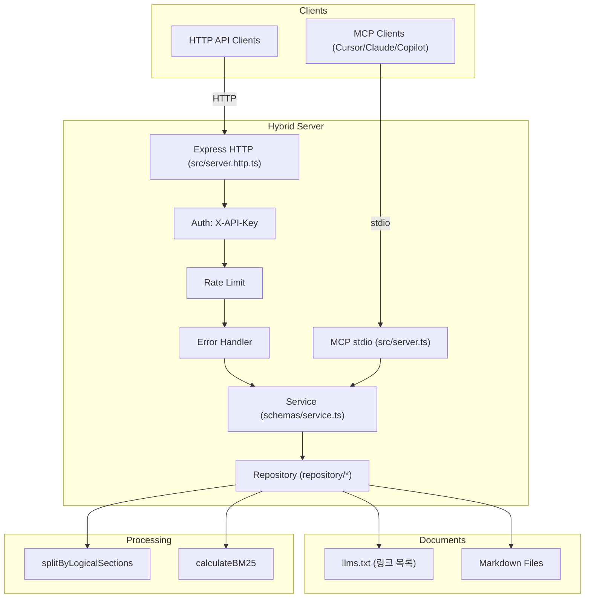

# 나이스페이먼츠 Developers MCP 서버

나이스페이먼츠 개발자 문서(마크다운)를 수집·청킹하고 BM25로 검색해 MCP(Model Context Protocol) 및 HTTP API로 제공하는 TypeScript 서버입니다.

## 📋 목차
- [프로젝트 개요](#프로젝트-개요)
- [데이터 소스](#데이터-소스)
- [로컬 개발 가이드](#로컬-개발-가이드)
- [시스템 아키텍처](#시스템-아키텍처)
- [프로젝트 구조](#프로젝트-구조)
- [핵심 컴포넌트 분석](#핵심-컴포넌트-분석)
- [데이터 플로우](#데이터-플로우)
- [핵심 알고리즘](#핵심-알고리즘)
- [API 명세](#api-명세)
- [코드 품질 및 패턴](#코드-품질-및-패턴)
- [확장 가능성](#확장-가능성)
- [개선 제안사항](#개선-제안사항)
- [사용방법](#사용방법)

## 프로젝트 개요

나이스페이먼츠 개발자 문서를 수집·청킹하고 BM25로 검색해 MCP(Model Context Protocol) 및 HTTP API로 제공하는 서비스입니다.

**본 MCP 서버의 목표**: 고객사가 MCP 서버를 통해 관련 내용(결제승인, 결제취소, 결제창 연결)을 손쉽게 수집, 참조하고 생성형 도구(Claude, Cursor, ChatGPT, GitHub Copilot 등)를 이용한 소스 코드 작성을 지원함으로써 결제 기능을 보다 편리하고 신뢰성 있게 구현하도록 돕는 것입니다.

### 기본 정보
- **패키지명**: `@nicepayments/developers-guide-mcp`
- **런타임/언어**: Node.js 22.x, TypeScript
- **제공 모드**: MCP(stdio), HTTP, Hybrid(MCP+HTTP)
- **주요 기능**: 문서 청킹/검색(BM25), MCP 툴 제공, API 키 인증, Rate Limiting, 에러 핸들링

---

## 데이터 소스

### 문서 소스 구조
- **llms.txt**: 문서 링크 목록 파일 (GitHub 원격 참조)
  - 위치: `https://github.com/supersignal/going_on_hypersonic/blob/main/src/llm/llms.txt`
  - 형식: `[제목](링크): 설명`
  - 예시: `[인증 결제 API](https://github.com/supersignal/going_on_hypersonic/blob/main/markdown/01.manual-auth.markdown): PC/MOBILE 결제창 호출하고 인증 결제를 구현할 수 있는 서비스와 주요 파라미터 설명 그리고 샘플코드`

- **마크다운 파일들**: 나이스페이먼츠 개발자 문서들
  - 위치: GitHub `markdown/` 디렉토리
  - 지원 문서 유형: 
    - **API**: 인증결제, 카드키인, 카드빌링, 가상계좌, 취소, 결제조회, 결제통보, 영수증
    - **APP**: iOS/Android 연동
    - **가이드**: G2 인증서 변경, FAQ, Quickstart

### 문서 메타데이터 구조
```markdown
***
title: 문서 제목
description: 문서 설명
keyword: 키워드1, 키워드2, 키워드3
-----
[마크다운 본문]
```

### 데이터 처리 파이프라인
1. **llms.txt 로드** → 링크 추출 → 마크다운 fetch
2. **메타데이터 파싱** → 논리 섹션 청킹 → 키워드 세트 생성
3. **BM25 인덱싱** → 검색 최적화

---

## 로컬 개발 가이드

### 개발 환경 설정
1. **저장소 클론 및 의존성 설치**
```bash
git clone <repository-url>
cd on_my_starboard_side
npm install
```

2. **환경변수 설정**
```bash
# .env 파일 생성 (env.example 참고)
cp env.example .env

# 개발용 설정 예시
NICEPAY_DATA_PATH=https://github.com/supersignal/going_on_hypersonic/blob/main/src/llm/llms.txt
NICEPAY_BASE_URL=https://github.com/supersignal/going_on_hypersonic/blob/main
NICEPAY_MARKDOWN_PATH=/markdown
NICEPAY_LLM_PATH=/src/llm
API_KEYS=dev-key-123,test-key-456
LOG_LEVEL=debug
```

3. **빌드 및 실행**
```bash
# 빌드
npm run build

# 개발 모드 (MCP stdio)
npm start

# HTTP 서버 모드
npm run start-http

# 하이브리드 모드 (MCP + HTTP)
npm run start-hybrid
```

### 개발 도구
```bash
# 타입 체크
npm run typecheck

# 린트
npm run lint

# 테스트
npm run test:ci
```

### 문제 해결
- **llms.txt 로드 실패**: 환경변수 `NICEPAY_DATA_PATH` 확인
- **마크다운 fetch 실패**: 네트워크 연결 및 GitHub 접근 권한 확인
- **빌드 오류**: Node.js 22.x 버전 및 TypeScript 설정 확인

---

## 시스템 아키텍처



---

## 3. 프로젝트 구조
```text
src/
├─ config/            # 환경 로드/검증 (zod)
├─ constants/         # 상수
├─ document/          # 마크다운 로딩/청킹/메타데이터
├─ middleware/        # 인증, 레이트리밋, 에러핸들러
├─ repository/        # 문서 저장소 + 검색
├─ schemas/           # 서비스 레이어 (툴 핸들러)
├─ utils/             # BM25 등 유틸리티
├─ server.ts          # MCP(stdio) 서버
├─ server.http.ts     # HTTP 서버
└─ server.hybrid.ts   # MCP+HTTP 하이브리드 서버
```

---

## 4. 핵심 컴포넌트 분석
- MCP 서버: `src/server.ts` — 툴 등록(`get_documents`, `document-details`) 및 stdio 트랜스포트 연결
- 하이브리드 서버: `src/server.hybrid.ts` — MCP + Express HTTP 브릿지, 인증/레이트리밋/에러 처리 포함
- 서비스: `src/schemas/service.ts` — 키워드 검색, 결과 포맷
- 저장소: `src/repository/*` — 문서 로딩, BM25 검색, 청크 윈도우링
- 문서 처리: `src/document/*` — 마크다운 fetch/파싱/청킹, 메타데이터 추출

---

## 5. 데이터 플로우
1) `llms.txt` 로드 → 링크 수집 → 마크다운 fetch → 논리 섹션 청킹 → 메타데이터/키워드 수집 → 저장소 적재
2) 검색 요청 → BM25 스코어링 → 상위 N 선택 → 청크 윈도우 적용 → 결과 포맷 후 반환
3) 상세 요청 → 문서 ID 매칭 → 원문 마크다운 반환

---

## 6. 핵심 알고리즘
- BM25(k1=1.2, b=0.75) 기반 정규화 스코어 계산
- 대소문자/변형 키워드 세트 구성, 정규식 OR 매칭
- 청크 윈도우 제공으로 주변 문맥 포함

---

## API 명세

### MCP 도구
- **get_documents**
  - 요청: `{ keywords: string[] }`
  - 응답: `{ content: [{ type: "text", text: string }], isError?: boolean }`
  - 예시: `{ "keywords": ["인증", "결제", "API"] }`

- **document-details**
  - 요청: `{ id: string }`
  - 응답: `{ content: [{ type: "text", text: string }], isError?: boolean }`
  - 예시: `{ "id": "5" }`

### HTTP 엔드포인트 (하이브리드/HTTP 모드)
- **인증**: 헤더 `X-API-Key: <your-api-key>` (필수, `/health`는 선택)
- **Rate Limit**: 검색(50/15m), 상세(200/15m), 헬스(10/1m)

#### 헬스체크
```bash
curl -s http://localhost:3000/health | cat
```
**응답 예시**:
```json
{
  "ok": true,
  "version": "1.0.0",
  "timestamp": "2024-01-01T00:00:00.000Z",
  "uptime": 123.456
}
```

#### 문서 검색
```bash
curl -s -X POST http://localhost:3000/mcp/get_documents \
  -H 'Content-Type: application/json' \
  -H 'X-API-Key: YOUR_KEY' \
  -d '{"keywords":["인증","결제","API"]}' | cat
```
**응답 예시**:
```json
{
  "content": [{
    "type": "text",
    "text": "## 원본문서 제목 : 인증 결제 API\n* 원본문서 ID : 1\n\n### 결제 요청\n결제 승인을 위한 API 호출 방법..."
  }]
}
```

#### 문서 상세 조회
```bash
curl -s http://localhost:3000/mcp/document-details/5 \
  -H 'X-API-Key: YOUR_KEY' | cat
```
**응답 예시**:
```json
{
  "content": [{
    "type": "text",
    "text": "***\ntitle: 취소 API\ndescription: 승인 취소 서비스와 주요 파라미터 설명 그리고 샘플코드\nkeyword: 취소, cancel, refund\n-----\n\n# 취소 API\n\n## 개요\n..."
  }]
}
```

---

## 8. 코드품질 및 패턴
- 타입 안전성: zod 기반 환경 검증(`src/config/validation.ts`), 명시적 타입 선언
- 레이어드 아키텍처: 서버/서비스/저장소/문서처리/유틸 분리
- 에러 처리: 표준화된 에러 응답, 요청 ID 전파, 개발환경 스택 노출
- 보안/안정성: API 키 인증, 키별 Rate Limiting, 입력 스키마 검증

---

## 9. 확장 가능성
- 검색엔진 교체/추가: BM25 → TF-IDF/임베딩/Hybrid
- 문서 소스 확장: 웹 크롤링, API, DB, Git 리포지토리
- 응답 형식: 텍스트 → JSON/HTML/PDF 등 가공 계층 추가
- 캐시: 메모리/파일/Redis

---

## 10. 개선 제안사항
- 구성 외부화 확대: 경로/파라미터 환경변수 일원화
- 테스트 커버리지 확장: 알고리즘/통합 경로 테스트
- 관측성: 성능/에러 메트릭, 구조화 로깅 도입
- API 버전 관리: v2 추가 시 병행 제공

---

## 사용방법

### 설치/빌드
```bash
npm install
npm run build
```

### 실행
```bash
# MCP(stdio)
npm start

# HTTP
npm run start-http

# Hybrid
npm run start-hybrid
```

### 환경변수 설정
`.env` 파일을 프로젝트 루트에 생성하세요. 예시는 `env.example` 참고.

**필수 환경변수**:
```bash
# API 보안 설정 (필수)
API_KEYS=test-key-123,prod-key-456,customer-key-789

# 문서 데이터 설정
NICEPAY_DATA_PATH=https://github.com/supersignal/going_on_hypersonic/blob/main/src/llm/llms.txt
NICEPAY_BASE_URL=https://github.com/supersignal/going_on_hypersonic/blob/main
NICEPAY_MARKDOWN_PATH=/markdown
NICEPAY_LLM_PATH=/src/llm
```

**선택 환경변수**:
```bash
# 서버 설정
PORT=3000
NODE_ENV=development
LOG_LEVEL=info

# 검색 설정
BM25_K1=1.2
BM25_B=0.75
MAX_SEARCH_RESULTS=10

# Rate Limiting 설정 (선택사항)
RATE_LIMIT_WINDOW_MS=900000
RATE_LIMIT_MAX_REQUESTS=100
```

### MCP 클라이언트 연동
- **Cursor**: MCP 설정에서 stdio 연결
- **Claude**: MCP 서버 등록 후 사용
- **GitHub Copilot**: MCP 프로토콜 지원 클라이언트에서 사용


---

*📝 작성일: 2025년8월5일*  
*🔄 최종 업데이트: 2025년9월2일* 
