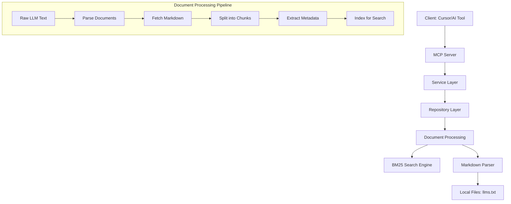

# 나이스페이먼츠 developers MCP 서버 프로젝트 분석 문서

## 📋 목차
1. [프로젝트 개요](#1-프로젝트-개요)
2. [시스템 아키텍처](#2-시스템-아키텍처)
3. [프로젝트 구조](#3-프로젝트-구조)
4. [핵심 컴포넌트 분석](#4-핵심-컴포넌트-분석)
5. [데이터 플로우](#5-데이터-플로우)
6. [핵심 알고리즘](#6-핵심-알고리즘)
7. [API 명세](#7-api-명세)
8. [코드 품질 및 패턴](#8-코드-품질-및-패턴)
9. [확장 가능성](#9-확장-가능성)
10. [개선 제안사항](#10-개선-제안사항)

---

## 1. 프로젝트 개요

### 1.1 기본 정보
- **프로젝트명**: `@going_on_hypersonic/developers-mcp`
- **버전**: 0.0.1
- **타입**: MCP (Model Context Protocol) 서버
- **주요 기능**: 나이스페이먼츠 developers 페이지 정보 제공
- **개발언어**: TypeScript (Node.js v22.17.1)
- **라이선스**: MIT

### 1.2 프로젝트 목적
나이스페이먼츠의 developers 사이트에서 제공중인 결제 연동 관련 문서들을 AI가 효율적으로 검색하고 참조할 수 있도록 하는 MCP 서버입니다.
Cursor, Claude, GitHub Copilot등과 같은 AI 개발 도구와 연동되어 실시간으로 결제 API 문서를 제공합니다.

### 1.3 핵심 기능
- 키워드 기반 문서 검색 (BM25 알고리즘 사용)
- 문서 청킹 (Chunking) 및 윈도우 기반 컨텍스트 제공
- 마크다운 파일 처리
- MCP 프로토콜 호환 API 제공

---

## 2. 시스템 아키텍처

### 2.1 전체 아키텍처



### 2.2 레이어별 구조
- **Presentation Layer**: MCP 서버 인터페이스 (`server.ts`)
- **Service Layer**: 비즈니스 로직 (`service.ts`)
- **Repository Layer**: 데이터 접근 (`repository.ts`)
- **Document Processing**: 문서 처리 및 파싱
- **Search Engine**: BM25 기반 검색 알고리즘
- **Utilities**: 공통 유틸리티 함수들

---

## 3. 프로젝트 구조

### 3.1 디렉토리 구조
```
src/
├── config/                            # 환경 정의
│   ├── env.d.ts                        # 기본 정의
│   ├── index.ts                        # 기본값 세팅
│   └── validation.ts                   # 유효성 검증
├── constants/                         # 상수 정의
│   ├── base-prompt.ts                  # 기본 프롬프트
│   ├── basic-http-headers.ts           # HTTP 헤더
│   └── category.ts                     # 문서 카테고리
├── document/                          # 문서 처리 관련
│   ├── document-chunk.ts               # 청크 타입 정의
│   ├── document-metadata.ts            # 메타데이터 타입
│   ├── markdown-document.fetcher.ts    # 마크다운 페처
│   ├── nicepayments-document.ts        # 문서
│   ├── nicepayments-document.loader.ts # 문서 로더
│   ├── parseLLMText.ts                 # LLM 텍스트 파서
│   └── splitByLogicalSections.ts       # 마크다운 분할기
├── llm/                               # LLM
|   └── llms.txt                        # 연동을 위한 개발자 문서
├── markdown/                          # Markdown
|   ├── 00.xxxxx.markdown               # 주요 markdown 00
|   ├── .....                           .....
|   └── 14.xxxxx.markdown               # 주요 markdown 14
├── repository/                        # 저장소
│   └── nicepayments-docs.repository.ts # 저장소 문서 처리
├── schemas/                           # 서비스 계층
│   ├── service.ts                      # 검색결과 처리
│   └── tool.ts                         # 키워드 검증
├── tests/                             # 테스트
│   └── server.test.ts                  # 테스트 서버
├── utils/                             # 유틸리티
│   ├── calculateBM25.ts                # BM25 검색 알고리즘
│   ├── logger.ts                       # 로거 도구
│   ├── metrics.ts                      # 메트릭 도구 
│   └── toRemoteMarkdownLink.ts         # 링크 변환 유틸
└── server.ts                          # 메인 서버
```

### 3.2 주요 의존성
```json
{
  "런타임 의존성": {
    "@modelcontextprotocol/sdk": "MCP 프로토콜 SDK",
    "zod": "스키마 검증",
    "unified": "마크다운 처리",
    "remark-parse": "마크다운 파싱"
  },
  "개발 의존성": {
    "@types/node": "Node.js 타입 정의",
    "vitest": "테스트 프레임워크",
    "typescript": "TypeScript 컴파일러"
  }
}
```

---

## 4. 핵심 컴포넌트 분석

### 4.1 MCP 서버 (server.ts)

#### 주요 기능
- MCP 프로토콜 기반 서버 구현
- 두 개의 주요 도구(Tool) 제공
- Zod(TypeScript용 스키마 검증 라이브러리) 스키마를 통한 입력 검증

#### 제공 도구
1. **get_documents**: 키워드 기반 문서 검색
2. **document-details**: 문서 ID로 상세 내용 조회

```typescript
// 핵심 코드 구조
const server = new McpServer({
  name: "nicepayments-integration-guide",
  description: "나이스페이먼츠 시스템 연동 도구",
  version: "1.0.0",
});

server.tool("get_documents", "문서 검색", schema, handler);
server.tool("document-details", "문서 상세", schema, handler);
```

### 4.2 문서 클래스 (NicePaymentsDocument)

#### 주요 특징
- 문서 메타데이터 관리
- 청킹(chunking) 기능
- 윈도우 기반 컨텍스트 검색
- 카테고리 기반 분류

#### 핵심 메서드
```typescript
class NicePaymentsDocument {
  // 청크 ID로 특정 청크 조회
  getChunkById(chunkId: number): DocumentChunk | undefined
  
  // 윈도우 사이즈로 주변 청크 포함 조회
  getChunkWithWindow(chunkId: number, windowSize: number): DocumentChunk[]
  
  // 카테고리 확인
  isCategory(category: Category): boolean
  
  // JSON 직렬화
  toJSON(): object
}
```

#### 청킹 전략
- 문서 ID * 1000 + 청크 인덱스로 고유 청크 ID 생성
- 단어 수 기반 청크 크기 계산
- 원본 문서 제목 및 메타데이터 보존

### 4.3 문서 로더 (NicePaymentsDocumentLoader)

#### 로딩 프로세스
1. **초기화**: RawDocs 배열과 DocumentFetcher 받기
2. **링크 수집**: 모든 문서 링크 추출
3. **문서 페치**: 각 링크에서 마크다운 문서 가져오기
4. **키워드 처리**: 대소문자 변형 포함 키워드 세트 생성
5. **카테고리 분류**: 링크 패턴으로 카테고리 판별
6. **문서 객체 생성**: NicePaymentsDocument 인스턴스 생성

#### 에러 처리
- 개별 문서 페치 실패 시 로그 출력 후 계속 진행
- 중복 링크 방지를 위한 invokedLinks Set 사용

### 4.4 레포지토리 (NicePaymentDocsRepository)

#### 핵심 기능
- 정적 팩토리 메서드로 초기화
- BM25 알고리즘 기반 문서 검색
- 청크 단위 검색 결과 정규화

#### 검색 프로세스
```typescript
// 1. 키워드로 BM25 점수 계산
const results = calculateBM25ScoresByKeywords(keywords.join("|"), documents);

// 2. 상위 N개 결과 선택
const topResults = results.slice(0, topN);

// 3. 청크 윈도우 적용
const chunks = topResults.map(item => 
  document.getChunkWithWindow(item.chunkId, 1)
);

// 4. 결과 정규화
const normalizedDocs = chunks.map(chunk => normalizeChunks(chunk));
```

#### 디버깅 지원
- 모든 주요 단계에서 상세한 디버그 로그 출력
- 검색 키워드, BM25 결과, 정제된 청크 정보 추적

### 4.5 마크다운 처리

#### 파일 페처 (MarkdownDocumentFetcher)
- 로컬 파일과 HTTP URL 모두 지원
- 절대 경로 및 file:// 프로토콜 처리
- BasicHttpHeaders를 사용한 HTTP 요청

#### 논리적 섹션 분할 (splitByLogicalSections)
```typescript
// 주요 처리 단계
1. 메타데이터 추출 (***...-----)
2. Unified + Remark를 이용한 AST 파싱
3. 헤딩(H1, H2) 기준으로 청크 분할
4. 코드 블록, 링크, 인라인 코드 처리
5. 짧은 청크들 병합 (최소 30단어)
```

#### 메타데이터 구조
```yaml
***
title: 문서 제목
description: 문서 설명
keyword: 키워드1, 키워드2, 키워드3
-----
```

---

## 5. 데이터 플로우

### 5.1 초기화 플로우
```
1. llms.txt 파일 읽기
2. parseLLMText()로 링크 추출
3. NicePaymentsDocumentLoader 생성
4. 각 링크에서 마크다운 문서 패치
5. splitByLogicalSections()로 청킹
6. 키워드 세트 생성 및 카테고리 분류
7. NicePaymentsDocument 객체 생성
8. Repository에 문서들 저장
9. BM25 인덱싱 준비 완료
```

### 5.2 검색 플로우
```
1. 클라이언트에서 키워드 배열 전송
2. Service에서 Repository 호출
3. calculateBM25ScoresByKeywords() 실행
4. 전체 청크에 대해 TF-IDF 계산
5. BM25 점수로 정렬
6. 상위 N개 결과 선택
7. 각 청크에 윈도우 적용
8. 결과 정규화 및 포맷팅
9. 클라이언트로 텍스트 응답
```

### 5.3 문서 상세 조회 플로우
```
1. 클라이언트에서 문서 ID 전송
2. Repository에서 findOneById() 호출
3. 해당 문서의 전체 content 반환
4. 클라이언트로 마크다운 텍스트 응답
```

---

## 6. 핵심 알고리즘

### 6.1 BM25 검색 알고리즘

#### 파라미터
- **k1**: 1.2 (용어 빈도 포화점)
- **b**: 0.75 (문서 길이 정규화 강도)

#### 핵심 공식
```typescript
// IDF (Inverse Document Frequency)
const idf = Math.log((N - df + 0.5) / (df + 0.5));

// BM25 Score
const numerator = f * (k1 + 1);
const denominator = f + k1 * (1 - b + b * (len / avgDocLength));
const score = idf * (numerator / denominator);
```

#### 구현 특징
- 정규표현식을 통한 유연한 키워드 매칭
- 대소문자 무시 검색
- 용어 빈도(TF)와 문서 빈도(DF) 별도 계산
- 문서 길이 정규화 적용

### 6.2 청킹 알고리즘

#### 분할 기준
1. **헤딩 기반**: H1, H2 헤딩을 기준으로 논리적 분할
2. **최소 단어 수**: 30단어 미만 청크는 자동 병합
3. **윈도우 기반**: 검색 시 주변 청크 포함 제공

#### 청크 ID 체계
```typescript
chunkId = documentId * 1000 + chunkIndex
```
- 문서당 최대 1000개 청크 지원
- 전역 고유성 보장

### 6.3 키워드 정규화

#### 변형 생성
```typescript
keywordSet.add(keyword.toLowerCase()); // 소문자
keywordSet.add(keyword.toUpperCase()); // 대문자  
keywordSet.add(keyword);               // 원본
```

#### 검색 패턴
- OR 연산: 키워드들을 `|`로 연결
- 정규표현식 이스케이프 처리
- 대소문자 무시 매칭

---

## 7. API 명세

### 7.1 get_documents 도구

#### 요청 스키마
```typescript
{
  keywords: string[] // UTF-8 인코딩된 문자열 배열
}
```

#### 응답 형식
```typescript
{
  content: [{
    type: "text",
    text: string // 검색된 문서 내용
  }],
  isError?: boolean
}
```

#### 사용 예시
```json
{
  "keywords": ["인증", "승인", "API", "WEBAPI", "결제", "취소"]
}
```

### 7.2 document-details 도구

#### 요청 스키마
```typescript
{
  id: string // 문서 ID (숫자 문자열)
}
```

#### 응답 형식
```typescript
{
  content: [{
    type: "text", 
    text: string // 전체 문서 마크다운
  }],
  isError?: boolean
}
```

#### 사용 예시
```json
{
  "id": "5"
}
```

### 7.3 응답 포맷

#### 검색 결과 포맷
```markdown
## 원본문서 제목 : [제목]
* 원본문서 ID : [ID]

[청크 내용 1]

[청크 내용 2]

...
```

#### 에러 응답
```typescript
{
  content: [{
    type: "text",
    text: "에러 메시지"
  }],
  isError: true
}
```

---

## 8. 코드 품질 및 패턴

### 8.1 사용된 디자인 패턴

#### Repository 패턴
- 데이터 접근 로직 캡슐화
- 비즈니스 로직과 데이터 계층 분리
- 테스트 용이성 증대

#### Factory 패턴
```typescript
static async load(link = "...") {
  // 복잡한 초기화 로직 캡슐화
  return new NicePaymentDocsRepository(documents);
}
```

#### Builder 패턴
- 문서 객체 단계적 구성
- 복잡한 객체 생성 과정 관리

### 8.2 타입 안전성

#### 엄격한 타입 정의
```typescript
// 인터페이스 기반 계약
interface DocumentChunk {
  id: number;
  chunkId: number;
  originTitle: string;
  text: string;
  wordCount: number;
}

// 유니온 타입으로 제한
type Category = "blog" | "codes" | "guides" | ...;
```

#### Zod 스키마 검증
```typescript
const GetDocumentSchema = {
  keywords: z.array(z.string()).describe("UTF-8 인코딩된 문자열 배열"),
};
```

### 8.3 에러 처리

#### 계층별 에러 처리
- **Service Layer**: 일반적인 에러를 사용자 친화적 메시지로 변환
- **Repository Layer**: 상세한 디버그 로그와 함께 안전한 폴백
- **Document Processing**: 개별 문서 실패가 전체에 영향 없도록 격리

#### 견고한 파일 처리
```typescript
try {
  llmText = await fs.readFile(link.replace('file://', ''), 'utf-8');
} catch (error) {
  console.error("[DEBUG] llms.txt 파일 로드 실패:", error);
  throw new Error(`Failed to read LLM text file: ${error}`);
}
```

### 8.4 성능 최적화

#### 메모리 효율성
- Set 자료구조로 중복 제거
- Map 자료구조로 빠른 조회
- lazy evaluation 활용

#### 검색 최적화
- BM25 전용 인덱스 구조
- 청크 단위 병렬 처리
- 윈도우 기반 컨텍스트 제한

---

## 9. 확장 가능성

### 9.1 새로운 검색 엔진 추가

#### 현재 BM25 외에 추가 가능한 엔진들
- **TF-IDF**: 전통적인 정보 검색
- **Semantic Search**: 임베딩 기반 의미 검색
- **Hybrid Search**: BM25 + 시맨틱 검색 조합

#### 인터페이스 확장
```typescript
interface SearchEngine {
  search(query: string, documents: Document[]): SearchResult[];
}

class BM25SearchEngine implements SearchEngine { ... }
class SemanticSearchEngine implements SearchEngine { ... }
```

### 9.2 문서 소스 확장

#### 현재 로컬 파일 외 지원 가능한 소스들
- **웹 크롤링**: 실시간 웹사이트 문서 수집
- **API 연동**: REST API 기반 문서 가져오기
- **데이터베이스**: 구조화된 문서 저장소
- **Git Repository**: 버전 관리되는 문서들

### 9.3 응답 형식 확장

#### 현재 텍스트 외 지원 가능한 형식들
- **JSON 구조화**: 메타데이터 포함 구조화된 응답
- **HTML 렌더링**: 웹 기반 문서 뷰어
- **PDF 생성**: 문서 다운로드 기능

### 9.4 캐싱 시스템

#### 도입 가능한 캐싱 전략들
- **메모리 캐시**: 자주 사용되는 검색 결과
- **파일 캐시**: 처리된 문서 메타데이터
- **Redis**: 분산 캐싱 시스템

---

## 10. 개선 제안사항

### 10.1 즉시 개선 가능한 사항들

#### 설정 관리 개선
```typescript
// 현재: 하드코딩된 경로
link = "https://github.com/supersignal/going_on_hypersonic/blob/main/llm/llms.txt"

// 개선: 환경변수 기반 설정
const config = {
  dataPath: process.env.NICEPAY_DATA_PATH || "./data",
  searchParams: {
    k1: parseFloat(process.env.BM25_K1) || 1.2,
    b: parseFloat(process.env.BM25_B) || 0.75
  }
};
```

#### 로깅 시스템 도입
```typescript
// 현재: console.log 사용
console.log('[DEBUG] 검색 키워드:', keywords);

// 개선: 구조화된 로깅
logger.info('document_search', {
  keywords,
  resultCount: results.length,
  executionTime: Date.now() - startTime
});
```

### 10.2 중기 개선 사항들

#### 테스트 커버리지 확대
```typescript
// 단위 테스트
describe('BM25 Algorithm', () => {
  test('should calculate correct scores', () => { ... });
  test('should handle empty queries', () => { ... });
});

// 통합 테스트  
describe('Document Search Integration', () => {
  test('should return relevant documents', () => { ... });
});
```

#### 성능 모니터링 추가
```typescript
interface PerformanceMetrics {
  searchLatency: number;
  documentCount: number;
  memoryUsage: number;
  cacheHitRate: number;
}
```

#### API 버전 관리
```typescript
// v1 API 유지하면서 v2 추가
server.tool("get_documents_v2", description, schema, handler);
```

### 10.3 장기 개선 사항들

#### 분산 아키텍처 도입
- **마이크로서비스**: 검색, 문서처리, 메타데이터 관리 분리
- **메시지 큐**: 비동기 문서 처리 파이프라인
- **로드 밸런싱**: 다중 서버 인스턴스 지원

#### AI/ML 기능 강화
- **자동 태깅**: 문서 내용 기반 자동 카테고리 분류
- **질의 확장**: 사용자 의도 파악 및 관련 키워드 제안
- **개인화**: 사용자별 검색 선호도 학습

#### 실시간 문서 동기화
- **파일 워처**: 실시간 문서 변경 감지
- **증분 업데이트**: 변경된 부분만 다시 인덱싱
- **버전 관리**: 문서 변경 이력 추적

---

## 📚 결론

이 나이스페이먼츠 developers MCP 서버는 잘 구조화된 문서 검색 시스템으로, MCP 프로토콜을 통해 AI 도구와 효과적으로 연동됩니다. 

### 주요 강점
- **모듈러 아키텍처**: 각 계층이 명확히 분리되어 유지보수성 우수
- **타입 안전성**: TypeScript와 Zod를 활용한 런타임 검증
- **확장 가능성**: 새로운 검색 엔진이나 문서 소스 추가 용이
- **견고한 에러 처리**: 개별 구성요소 실패가 전체 시스템에 영향 없음

### 개선 영역
- 설정 관리 외부화 필요
- 테스트 커버리지 확대 필요  
- 성능 모니터링 체계 부재
- 하드코딩된 경로 및 설정값들 최소화

전반적으로 프로덕션 환경에서 사용 가능한 수준의 코드 품질을 보여주며, 제안된 개선사항들을 단계적으로 적용하면 더욱 견고하고 확장 가능한 시스템으로 발전시킬 수 있습니다.

### 주요 markdown
📚 Quickstart https://github.com/supersignal/going_on_hypersonic/blob/main/markdown/00.index.markdown

📚 인증 결제 API https://github.com/supersignal/going_on_hypersonic/blob/main/markdown/01.manual-auth.markdown

📚 카드 키인 API https://github.com/supersignal/going_on_hypersonic/blob/main/markdown/02.manual-card-keyin.markdown

📚 카드 빌링 API https://github.com/supersignal/going_on_hypersonic/blob/main/markdown/03.manual-card-billing.markdown

📚 가상계좌 발급 API https://github.com/supersignal/going_on_hypersonic/blob/main/markdown/04.manual-virtual-account.markdown

📚 취소 API https://github.com/supersignal/going_on_hypersonic/blob/main/markdown/05.manual-cancel.markdown

📚 APP(iOS/Android) https://github.com/supersignal/going_on_hypersonic/blob/main/markdown/06.manual-app.markdown

📚 결제조회 API https://github.com/supersignal/going_on_hypersonic/blob/main/markdown/07.manual-status.markdown

📚 결제통보 API https://github.com/supersignal/going_on_hypersonic/blob/main/markdown/08.manual-noti.markdown

📚 영수증 API https://github.com/supersignal/going_on_hypersonic/blob/main/markdown/09.manual-receipt.markdown

📚 카드사/은행 코드 https://github.com/supersignal/going_on_hypersonic/blob/main/markdown/10.manual-code-partner.markdown

📚 결과코드 https://github.com/supersignal/going_on_hypersonic/blob/main/markdown/11.manual-code.markdown

📚 예외/보안 처리 https://github.com/supersignal/going_on_hypersonic/blob/main/markdown/12.manual-exception.markdown

📚 G2 인증서 변경 가이드 https://github.com/supersignal/going_on_hypersonic/blob/main/markdown/13.manual-digicert-apply.markdown

📚 FAQ https://github.com/supersignal/going_on_hypersonic/blob/main/markdown/14.tip.markdown


---

*📝 작성일: 2025년8월5일*  
*🔄 최종 업데이트: 2025년8월20일* 
